# URL Shortener - Architecture & System Overview

> **Complete Architecture Documentation for Presentation**  
> Digital Egypt Pioneers Initiative - DevOps Track

---

## Table of Contents

1. [Project Overview](#project-overview)
2. [System Architecture](#system-architecture)
3. [Microservices Design](#microservices-design)
4. [Frontend Architecture](#frontend-architecture)
5. [Backend Architecture](#backend-architecture)
6. [Data Flow & Communication](#data-flow--communication)
7. [Monitoring Stack](#monitoring-stack)
8. [Docker Infrastructure](#docker-infrastructure)
9. [Network Architecture](#network-architecture)
10. [Data Persistence](#data-persistence)
11. [Technology Stack Summary](#technology-stack-summary)

---

## Project Overview

### What is This Project?

A **URL Shortener** web application that transforms long URLs into short, shareable links. The system is built using a **microservices architecture** with comprehensive monitoring capabilities.

### Key Features

| Feature | Description |
|---------|-------------|
| **URL Shortening** | Convert long URLs to short, shareable links |
| **File Sharing** | Upload and share images and PDF files |
| **Note Sharing** | Create and share text notes |
| **User Authentication** | Secure registration and login |
| **Click Tracking** | Monitor link usage statistics |
| **Real-time Monitoring** | Prometheus metrics + Grafana dashboards |

### Team Members

- **Beshoy Ibrahim Asham Melek**
- **Hassan Saleh Hassan Gad**
- **Joseph Sameh Fouad Nasr**

---

## System Architecture

### High-Level Overview

```mermaid
graph TB
    subgraph "Client Layer"
        User[("👤 User Browser")]
    end
    
    subgraph "Docker Host"
        subgraph "Application Services"
            FE[Frontend<br/>React + Nginx<br/>Port 9000]
            
            subgraph "Backend Microservices"
                AUTH[Auth Service<br/>Port 9001]
                URL[URL Service<br/>Port 9002]
                FILE[File Service<br/>Port 9003]
                NOTE[Note Service<br/>Port 9004]
            end
        end
        
        subgraph "Monitoring Stack"
            PROM[Prometheus<br/>Port 9090]
            GRAF[Grafana<br/>Port 3000]
        end
        
        subgraph "Data Storage"
            DB1[(auth.db)]
            DB2[(urls.db)]
            DB3[(files.db)]
            DB4[(notes.db)]
            TSDB[(Prometheus TSDB)]
        end
    end
    
    User -->|HTTP| FE
    FE -->|REST API| AUTH
    FE -->|REST API| URL
    FE -->|REST API| FILE
    FE -->|REST API| NOTE
    
    AUTH --> DB1
    URL --> DB2
    FILE --> DB3
    NOTE --> DB4
    
    PROM -->|Scrape Metrics| AUTH
    PROM -->|Scrape Metrics| URL
    PROM -->|Scrape Metrics| FILE
    PROM -->|Scrape Metrics| NOTE
    PROM --> TSDB
    
    GRAF -->|Query| PROM
    User -->|View Dashboards| GRAF
```



### Architecture Principles

1. **Microservices Pattern**: Each service is independent and focused on a single domain
2. **Containerization**: All services run in Docker containers
3. **Service Isolation**: Each service has its own database
4. **Shared Authentication**: JWT tokens validated across all services
5. **Centralized Monitoring**: Single Prometheus instance scrapes all services

---

## Microservices Design

### Service Overview


### Service Details

| Service | Port | Technology | Database | Primary Responsibility |
|---------|------|------------|----------|------------------------|
| **Auth Service** | 9001 | Spring Boot + Kotlin | auth.db (SQLite) | User authentication & JWT management |
| **URL Service** | 9002 | Spring Boot + Kotlin | urls.db (SQLite) | URL shortening & redirection |
| **File Service** | 9003 | Spring Boot + Kotlin | files.db (SQLite) | File upload & sharing |
| **Note Service** | 9004 | Spring Boot + Kotlin | notes.db (SQLite) | Note creation & sharing |
| **Frontend** | 9000 | React + Nginx | - | User interface |

### API Endpoints Summary

#### Auth Service (Port 9001)
```
POST /api/auth/register  → Register new user
POST /api/auth/login     → Login and get JWT token
GET  /actuator/prometheus → Metrics endpoint
```

#### URL Service (Port 9002)
```
POST /shorten           → Create short URL
GET  /{shortCode}       → Redirect to original URL
GET  /api/urls/my-urls  → Get user's URLs
GET  /actuator/prometheus → Metrics endpoint
```

#### File Service (Port 9003)
```
POST /api/files/upload    → Upload file
GET  /f/{shortCode}       → Download/view file
GET  /api/files/my-files  → Get user's files
GET  /actuator/prometheus → Metrics endpoint
```

#### Note Service (Port 9004)
```
POST /api/notes/save     → Save note
GET  /n/{shortCode}      → View note
GET  /api/notes/my-notes → Get user's notes
GET  /actuator/prometheus → Metrics endpoint
```

---

## Frontend Architecture

### Technology Stack


### Component Structure

```
frontend/
├── src/
│   ├── App.jsx              # Main application component
│   ├── main.jsx             # Application entry point
│   ├── components/
│   │   ├── Header.jsx       # Navigation & theme toggle
│   │   ├── UrlShortener.jsx # URL shortening form
│   │   ├── FileUpload.jsx   # File upload component
│   │   ├── TextSaver.jsx    # Note saving component
│   │   ├── Login.jsx        # Login modal
│   │   ├── Register.jsx     # Registration modal
│   │   ├── UrlHistory.jsx   # Recent URLs list
│   │   └── UserHistory.jsx  # User's saved items
│   ├── config/
│   │   └── api.js           # API endpoint configuration
│   └── context/
│       └── AuthContext.jsx  # Authentication state
├── Dockerfile               # Multi-stage Docker build
└── package.json             # Dependencies
```

### Frontend-to-Backend Communication


---

## Backend Architecture

### Spring Boot Service Structure

Each microservice follows the same architectural pattern:


### Service Architecture Pattern

```
microservices/
├── auth-service/
│   ├── src/main/kotlin/
│   │   └── com/urlshortener/auth/
│   │       ├── AuthApplication.kt       # Main class
│   │       ├── controller/              # REST endpoints
│   │       ├── service/                 # Business logic
│   │       ├── repository/              # Data access
│   │       ├── model/                   # Domain entities
│   │       ├── security/                # JWT handling
│   │       └── config/                  # Configuration
│   ├── build.gradle.kts
│   └── Dockerfile
├── url-service/
├── file-service/
└── note-service/
```

### Security Flow (JWT Authentication)


### Shared JWT Secret

All services share the same `JWT_SECRET` environment variable to validate tokens:

```
┌──────────────────────────────────────────────────────────────────────┐
│                           JWT_SECRET                                 │
│              (Shared across all microservices)                       │
├──────────────────────────────────────────────────────────────────────┤
│  Auth Service  │  URL Service  │  File Service  │    Note Service    │
│  (generates)   │  (validates)  │   (validates)  │    (validates)     │
└──────────────────────────────────────────────────────────────────────┘
```

---

## Data Flow & Communication

### User Journey - URL Shortening


### Service Communication Pattern


**Key Design Decision**: Services do not communicate with each other directly. Each service validates JWT tokens independently using the shared secret.

---

## Monitoring Stack

### Prometheus Architecture


### Metrics Flow


### Prometheus Configuration

```yaml
# prometheus.yml
global:
  scrape_interval: 15s      # How often to scrape
  evaluation_interval: 15s   # How often to evaluate rules

scrape_configs:
  - job_name: 'auth-service'
    metrics_path: '/actuator/prometheus'
    static_configs:
      - targets: ['auth-service:9001']
        labels:
          service: 'auth'

  - job_name: 'url-service'
    metrics_path: '/actuator/prometheus'
    static_configs:
      - targets: ['url-service:9002']
        labels:
          service: 'url'

  # ... file-service and note-service similar
```

### Grafana Dashboard Structure


### Key Metrics Monitored

| Metric Category | Metric Name | Description |
|-----------------|-------------|-------------|
| **HTTP** | `http_server_requests_seconds_count` | Total request count |
| **HTTP** | `http_server_requests_seconds_sum` | Total request time |
| **HTTP** | `http_server_requests_seconds_bucket` | Response time histogram |
| **JVM** | `jvm_memory_used_bytes` | Current memory usage |
| **JVM** | `jvm_gc_pause_seconds` | Garbage collection pauses |
| **System** | `system_cpu_usage` | CPU utilization |
| **System** | `process_uptime_seconds` | Service uptime |

---

## Docker Infrastructure

### Container Architecture


### Docker Compose Services

```yaml
services:
  # Application Services
  auth-service:     # Port 9001 → 9001
  url-service:      # Port 9002 → 9002
  file-service:     # Port 9003 → 9003
  note-service:     # Port 9004 → 9004
  frontend:         # Port 9000 → 80

  # Monitoring Services
  prometheus:       # Port 9090 → 9090
  grafana:          # Port 3000 → 3000

networks:
  microservices:    # Service-to-service communication
  monitoring:       # Prometheus scraping

volumes:
  prometheus_data:  # Named volume for Prometheus TSDB
```

### Multi-Stage Build (Frontend)

```dockerfile
# Stage 1: Build React application
FROM node:18-alpine AS build
WORKDIR /app
COPY frontend/package*.json ./
RUN npm install
COPY frontend/ .
RUN npm run build

# Stage 2: Serve with Nginx
FROM nginx:alpine
COPY --from=build /app/dist /usr/share/nginx/html
EXPOSE 80
CMD ["nginx", "-g", "daemon off;"]
```

### Backend Service Build

```dockerfile
FROM eclipse-temurin:21-jre-jammy
WORKDIR /app
COPY microservices/auth-service/build/libs/auth-service-0.0.1-SNAPSHOT.jar app.jar
RUN mkdir -p /app/data
EXPOSE 9001
CMD ["java", "-jar", "app.jar"]
```

---

## Network Architecture

### Network Topology


### Port Mapping

| Service | Host Port | Container Port | Protocol |
|---------|-----------|----------------|----------|
| Frontend | 9000 | 80 | HTTP |
| Auth Service | 9001 | 9001 | HTTP |
| URL Service | 9002 | 9002 | HTTP |
| File Service | 9003 | 9003 | HTTP |
| Note Service | 9004 | 9004 | HTTP |
| Prometheus | 9090 | 9090 | HTTP |
| Grafana | 3000 | 3000 | HTTP |

### Service Discovery

Services communicate using Docker's internal DNS:
- `auth-service:9001` (not localhost)
- `url-service:9002`
- `file-service:9003`
- `note-service:9004`
- `prometheus:9090`

---

## Data Persistence

### Storage Strategy

```mermaid
graph TB
    subgraph "Bind Mounts (Host → Container)"
        HD[Host: ./data/]
        HD --> |./data/auth| CA[Container: /app/data]
        HD --> |./data/urls| CU[Container: /app/data]
        HD --> |./data/files| CF[Container: /app/data]
        HD --> |./data/notes| CN[Container: /app/data]
    end
    
    subgraph "Named Volume (Docker Managed)"
        PV[prometheus_data]
        PV --> CP[Container: /prometheus]
    end
    
    subgraph "SQLite Databases"
        CA --> DB1[(auth.db)]
        CU --> DB2[(urls.db)]
        CF --> DB3[(files.db)]
        CN --> DB4[(notes.db)]
    end
    
    subgraph "Prometheus Time Series"
        CP --> TSDB[(TSDB)]
    end
```



### Data Directory Structure

```
./data/
├── auth/
│   └── auth.db              # User accounts and credentials
├── urls/
│   └── urls.db              # Shortened URLs and click stats
├── files/
│   ├── files.db             # File metadata
│   └── uploads/             # Actual uploaded files
└── notes/
    └── notes.db             # Note content and metadata
```

### Why SQLite?

| Advantage | Description |
|-----------|-------------|
| **Simplicity** | No separate database server needed |
| **Portability** | Single file per database |
| **Performance** | Fast for read-heavy workloads |
| **Zero Configuration** | Works out of the box |
| **Easy Backup** | Just copy the .db files |

---

## Technology Stack Summary

### Complete Technology Overview


### Technology Details

| Layer | Technology | Version | Purpose |
|-------|------------|---------|---------|
| **Frontend** | React | 19 | UI framework |
| **Frontend** | Vite | Latest | Build tool & dev server |
| **Frontend** | Nginx | Alpine | Production web server |
| **Backend** | Spring Boot | 3.5 | Application framework |
| **Backend** | Kotlin | Latest | Programming language |
| **Backend** | Micrometer | Latest | Metrics instrumentation |
| **Database** | SQLite | Latest | Data persistence |
| **Container** | Docker | Latest | Containerization |
| **Orchestration** | Docker Compose | Latest | Multi-container management |
| **Metrics** | Prometheus | Latest | Metrics collection |
| **Visualization** | Grafana | Latest | Dashboards & alerting |
| **JRE** | Eclipse Temurin | 21 | Java runtime |

### Architecture Benefits Summary

| Principle | Benefit |
|-----------|---------|
| **Microservices** | Independent scaling, fault isolation, team autonomy |
| **Containerization** | Consistent environments, easy deployment, portability |
| **Monitoring** | Real-time visibility, proactive issue detection |
| **JWT Authentication** | Stateless, scalable, secure |
| **SQLite** | Simple, fast, no external dependencies |

---

## Quick Access URLs

After running `docker compose up`:

| Service | URL | Credentials |
|---------|-----|-------------|
| **Frontend** | http://localhost:9000 | Create account |
| **Prometheus** | http://localhost:9090 | None required |
| **Grafana** | http://localhost:3000 | admin / admin |

---

## Deployment Commands

```bash
# 1. Build all services
./build.sh

# 2. Start everything
docker compose up -d

# 3. View logs
docker compose logs -f

# 4. Check service status
docker compose ps

# 5. Stop everything
docker compose down
```

---

**Digital Egypt Pioneers Initiative - DevOps Track**  
**URL Shortener Microservices Project**  
**Last Updated:** December 1, 2024
