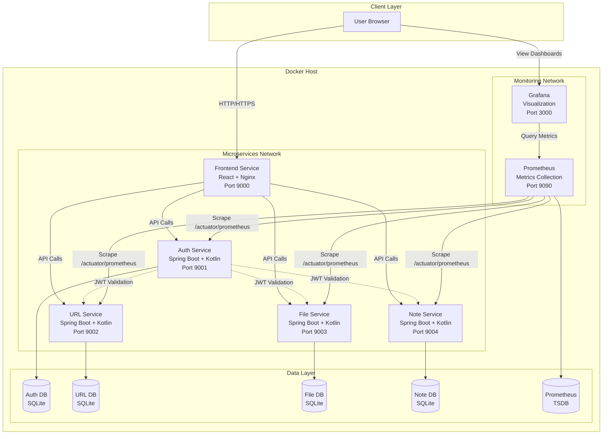
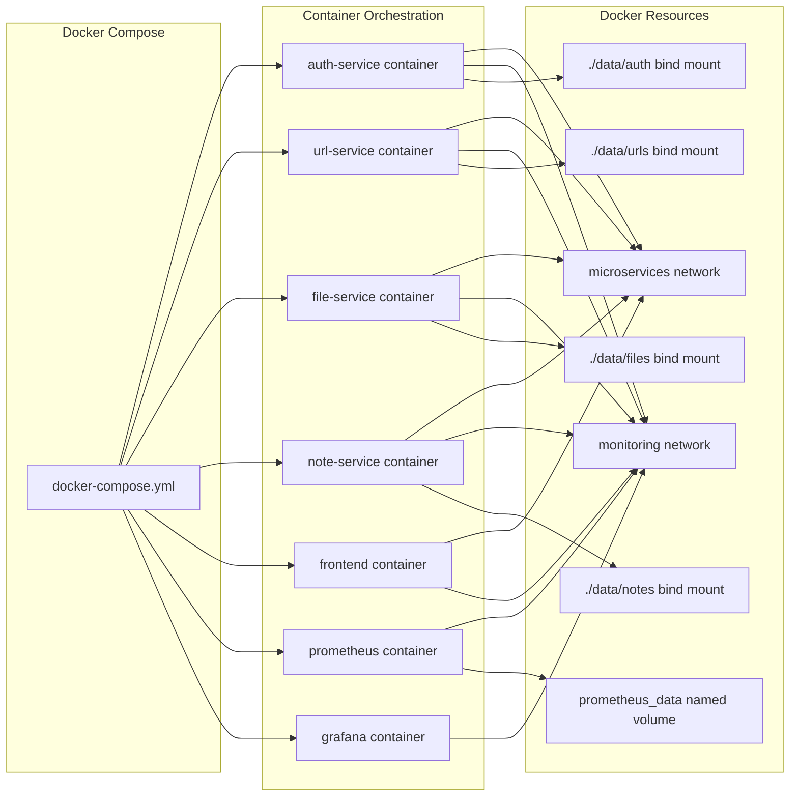
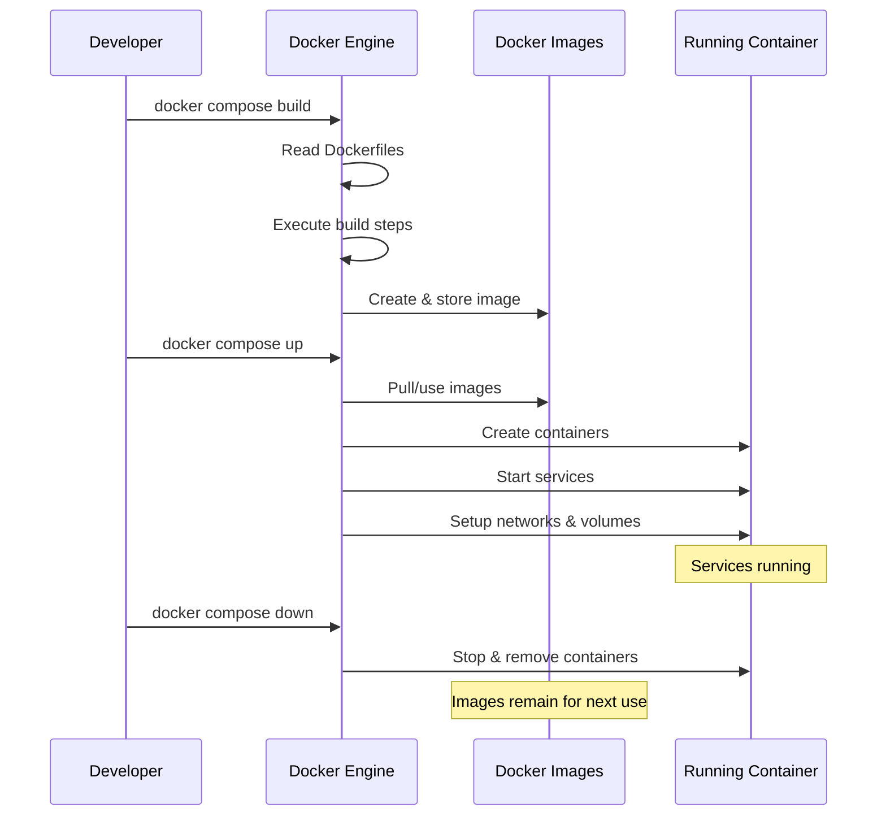
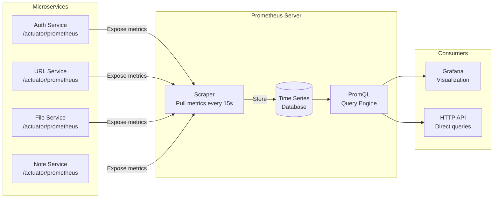
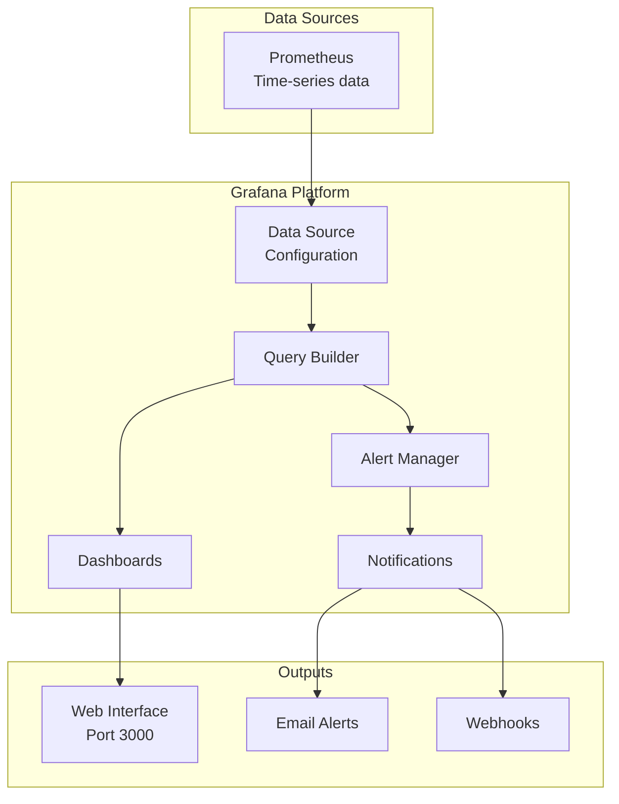
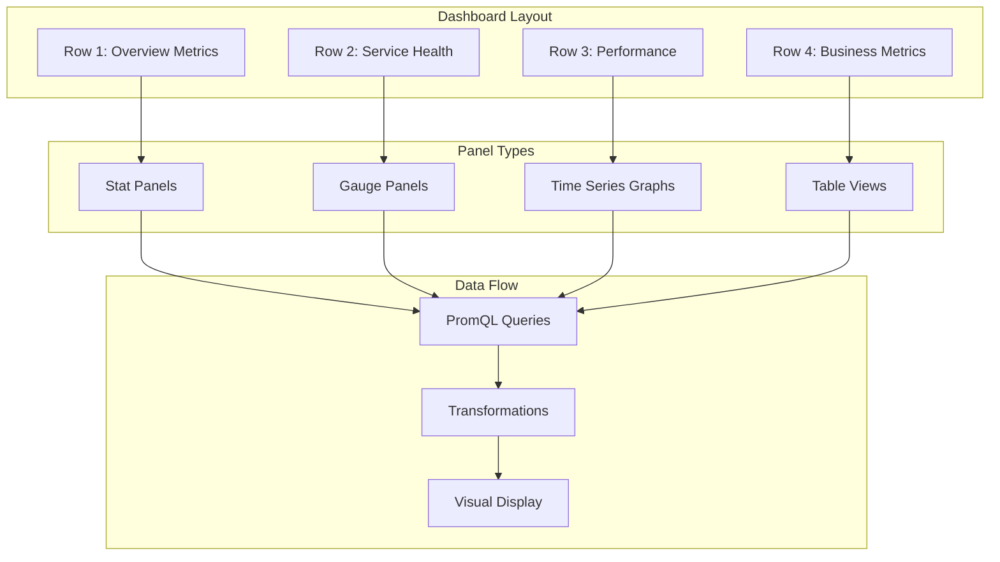
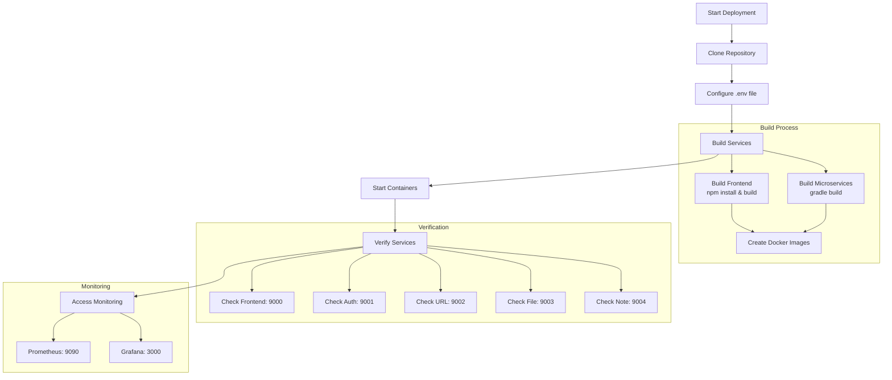
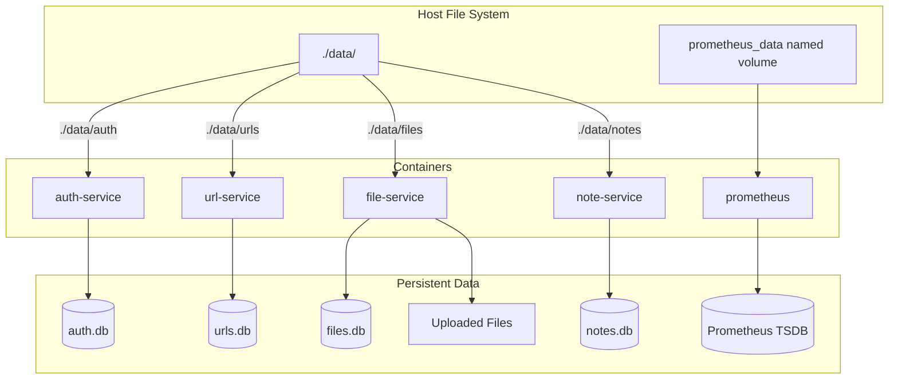
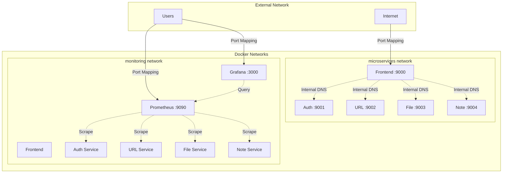

# DevOps Documentation: URL Shortener Application

> **Complete DevOps Guide** - Understanding the architecture, Docker containerization, monitoring with Prometheus & Grafana, and deployment strategies

---

## Table of Contents

1. [Architecture Overview](#architecture-overview)
2. [Docker Infrastructure](#docker-infrastructure)
3. [Prometheus Monitoring](#prometheus-monitoring)
4. [Grafana Visualization](#grafana-visualization)
5. [Deployment Guide](#deployment-guide)
6. [Data Persistence](#data-persistence)
7. [Networking](#networking)
8. [Benefits & Best Practices](#benefits--best-practices)
9. [Troubleshooting](#troubleshooting)

---

## Architecture Overview

### System Architecture Diagram



### Microservices Architecture

The application follows a **microservices architecture** pattern with the following characteristics:

#### Service Breakdown

| Service | Port | Technology | Database | Purpose |
|---------|------|------------|----------|---------|
| **Frontend** | 9000 | React 19 + Nginx | - | User interface and static assets |
| **Auth Service** | 9001 | Spring Boot + Kotlin | auth.db | Authentication and user management |
| **URL Service** | 9002 | Spring Boot + Kotlin | urls.db | URL shortening and redirection |
| **File Service** | 9003 | Spring Boot + Kotlin | files.db | File upload and sharing |
| **Note Service** | 9004 | Spring Boot + Kotlin | notes.db | Note creation and sharing |
| **Prometheus** | 9090 | Prometheus | Time-series DB | Metrics collection |
| **Grafana** | 3000 | Grafana | - | Metrics visualization |

---

## Docker Infrastructure

### What is Docker?

**Docker** is a containerization platform that packages applications and their dependencies into isolated, portable containers. Each container runs independently with its own filesystem, networking, and process space.

### Benefits of Using Docker

1. **Consistency**: "Works on my machine" → "Works everywhere"
2. **Isolation**: Each service runs in its own container
3. **Portability**: Deploy anywhere Docker runs
4. **Resource Efficiency**: Lighter than virtual machines
5. **Scalability**: Easy to scale individual services
6. **Version Control**: Docker images are versioned

### Docker Compose Architecture



### Dockerfile Breakdown

#### Multi-stage Build (Frontend)

```dockerfile
# Stage 1: Build the React application
FROM node:18-alpine AS build
WORKDIR /app
COPY frontend/package*.json ./
RUN npm install
COPY frontend/ .
RUN npm run build

# Stage 2: Serve with Nginx
FROM nginx:alpine
COPY --from=build /app/dist /usr/share/nginx/html
EXPOSE 80
CMD ["nginx", "-g", "daemon off;"]
```

**Benefits:**
- **Smaller Image Size**: Final image only contains built assets and Nginx
- **Security**: Build tools not present in production image
- **Performance**: Optimized for serving static files

#### Backend Services (Spring Boot + Kotlin)

```dockerfile
FROM eclipse-temurin:21-jre-jammy
WORKDIR /app
COPY microservices/auth-service/build/libs/auth-service-0.0.1-SNAPSHOT.jar app.jar
RUN mkdir -p /app/data
EXPOSE 9001
CMD ["java", "-jar", "app.jar"]
```

**Benefits:**
- **Lightweight JRE**: Only runtime, not full JDK
- **Fast Startup**: Pre-built JAR file
- **Consistent Environment**: Same Java version everywhere

### Docker Compose Configuration

The `docker-compose.yml` file orchestrates all services:

```yaml
services:
  auth-service:
    build:
      context: .
      dockerfile: microservices/auth-service/Dockerfile
    container_name: auth-service
    ports:
      - "9001:9001"
    env_file:
      - .env
    volumes:
      - ./data/auth:/app/data
    networks:
      - microservices
      - monitoring
```

**Key Components:**

1. **build**: Specifies how to build the container
2. **ports**: Maps host port to container port (host:container)
3. **env_file**: Loads environment variables from `.env` file
4. **volumes**: Persists data outside the container
5. **networks**: Connects containers for communication

### How Docker Works in This Project



---

## Prometheus Monitoring

### What is Prometheus?

**Prometheus** is an open-source monitoring and alerting toolkit designed for reliability and scalability. It collects and stores metrics as time-series data with timestamps.

### Architecture and Data Flow



### How Prometheus Works

1. **Pull-based Model**: Prometheus scrapes metrics from services
2. **Time-Series Storage**: Stores metrics with timestamps
3. **PromQL**: Powerful query language for metrics
4. **Service Discovery**: Automatically discovers services to monitor

### Configuration (`prometheus.yml`)

```yaml
global:
  scrape_interval: 15s      # Scrape targets every 15 seconds
  evaluation_interval: 15s   # Evaluate rules every 15 seconds

scrape_configs:
  - job_name: 'auth-service'
    metrics_path: '/actuator/prometheus'
    static_configs:
      - targets: ['auth-service:9001']
        labels:
          service: 'auth'
```

**Key Configuration:**

- **scrape_interval**: How often to collect metrics (15 seconds)
- **metrics_path**: Endpoint where metrics are exposed
- **targets**: Services to monitor (using Docker service names)
- **labels**: Custom labels for filtering and grouping

### Metrics Collected

#### Standard Spring Boot Metrics (via Micrometer)

| Metric Type | Examples | Purpose |
|-------------|----------|---------|
| **HTTP Metrics** | `http_server_requests_seconds` | Request duration, status codes |
| **JVM Metrics** | `jvm_memory_used_bytes` | Memory usage, GC activity |
| **System Metrics** | `system_cpu_usage` | CPU, disk I/O |
| **Database Metrics** | `jdbc_connections_active` | Connection pool status |
| **Custom Metrics** | `url_shortener_clicks_total` | Business-specific metrics |

### Benefits of Prometheus

1. **Real-time Monitoring**: Track service health in real-time
2. **Historical Data**: Analyze trends over time
3. **Alerting**: Automatic alerts on anomalies
4. **Multi-dimensional Data**: Query by multiple labels
5. **Reliability**: Designed for operational simplicity
6. **Active Community**: Wide adoption and support

### How to Use Prometheus

#### Access the UI
```
http://localhost:9090
```

#### Example Queries (PromQL)

```promql
# Request rate per service
rate(http_server_requests_seconds_count[5m])

# Memory usage by service
jvm_memory_used_bytes{area="heap"}

# 95th percentile response time
histogram_quantile(0.95, rate(http_server_requests_seconds_bucket[5m]))

# Error rate
rate(http_server_requests_seconds_count{status=~"5.."}[5m])
```

---

## Grafana Visualization

### What is Grafana?

**Grafana** is an open-source platform for monitoring and observability. It queries, visualizes, and alerts on metrics from multiple data sources, including Prometheus.

### Grafana Architecture



### Grafana Configuration in Docker

```yaml
grafana:
  image: grafana/grafana:latest
  container_name: grafana
  ports:
    - "3000:3000"
  environment:
    - GF_SECURITY_ADMIN_USER=${GRAFANA_USER}
    - GF_SECURITY_ADMIN_PASSWORD=${GRAFANA_PASSWORD}
    - GF_PATHS_PROVISIONING=/etc/grafana/provisioning
  volumes:
    - ./grafana/provisioning:/etc/grafana/provisioning
    - ./grafana/dashboards:/etc/grafana/dashboards
```

### Provisioning Structure

```
grafana/
├── provisioning/
│   ├── datasources/
│   │   └── datasource.yaml          # Auto-configure Prometheus
│   ├── dashboards/
│   │   └── dashboards.yaml          # Auto-load dashboards
│   └── alerting/
│       ├── alert_rule.json          # Alert definitions
│       ├── contact-points.yaml      # Notification channels
│       └── notification-policy.yaml # Alert routing
└── dashboards/
    └── url_shortener_dashboard.json # Dashboard definition
```

### Data Source Configuration

```yaml
apiVersion: 1
datasources:
  - name: Prometheus
    uid: prometheus-datasource
    type: prometheus
    access: proxy
    url: http://prometheus:9090
    isDefault: true
```

**Benefits of Auto-provisioning:**
- No manual configuration needed
- Version-controlled dashboards
- Consistent across environments
- Easy to replicate

### Dashboard Components



### Key Metrics Visualized

1. **System Health**
   - Service uptime
   - CPU and memory usage
   - Request rate (requests/second)

2. **Performance**
   - Response time (p50, p95, p99)
   - Error rate
   - Throughput

3. **Business Metrics**
   - URLs shortened
   - Files uploaded
   - Active users
   - Click tracking

### Alert Configuration

```yaml
# Contact Points
apiVersion: 1
contactPoints:
  - name: email-alerts
    receivers:
      - uid: email-receiver
        type: email
        settings:
          addresses: alerts@example.com
```

**Alert Rules:**
- High error rate (> 5%)
- High response time (> 1s)
- Low service availability
- Memory usage threshold

### Benefits of Grafana

1. **Visual Insights**: Beautiful, customizable dashboards
2. **Real-time Updates**: Live data refresh
3. **Alerting**: Proactive problem detection
4. **Multi-source**: Connect to multiple data sources
5. **Collaboration**: Share dashboards with teams
6. **Flexibility**: Highly customizable visualizations

### How to Use Grafana

#### 1. Access the UI
```
http://localhost:3000
Username: admin (from .env)
Password: admin (from .env)
```

#### 2. View Dashboards
- Navigate to **Dashboards** → **URL Shortener Dashboard**
- Pre-configured panels show all key metrics
- Refresh interval: 5 seconds (configurable)

#### 3. Customize Dashboards
- Click **Edit** on any panel
- Modify PromQL queries
- Change visualization type
- Add new panels

#### 4. Set Up Alerts
- Navigate to **Alerting** → **Alert Rules**
- Create new alert rules
- Configure notification channels
- Set up alert policies

#### 5. Explore Metrics
- Use **Explore** tab
- Write custom PromQL queries
- Analyze specific metrics
- Debug issues

---

## Deployment Guide

### Prerequisites

```bash
# Check Docker installation
docker --version
docker compose --version

# Check Java (for local development)
java --version  # Should be Java 21

# Check Node.js (for frontend development)
node --version  # Should be 18+
npm --version
```

### Deployment Flow



### Step-by-Step Deployment

#### 1. Clone the Repository

```bash
git clone https://github.com/Joseph-Sameh-0/monitoring-a-containerized-url-shortener-webservice-3.git
cd monitoring-a-containerized-url-shortener-webservice-3
```

#### 2. Configure Environment Variables

```bash
# Copy example environment file
cp .env.example .env

# Edit .env file with your settings
nano .env  # or use your preferred editor
```

**Important Variables:**

```bash
# JWT Secret (minimum 32 characters)
JWT_SECRET=your-very-secure-secret-key-here

# Grafana Credentials
GRAFANA_USER=admin
GRAFANA_PASSWORD=your-secure-password

# Email Notifications (optional)
EMAIL_ADDRESSES=your-email@example.com
GF_SMTP_ENABLED=true
GF_SMTP_HOST=smtp.gmail.com:587
GF_SMTP_USER=your-email@gmail.com
GF_SMTP_PASSWORD=your-app-password
```

#### 3. Build the Application

```bash
# Make build script executable
chmod +x build.sh

# Build all services
./build.sh
```

**What happens during build:**
1. Frontend: `npm install` → `npm run build`
2. Auth Service: `gradlew clean build`
3. URL Service: `gradlew clean build`
4. File Service: `gradlew clean build`
5. Note Service: `gradlew clean build`

#### 4. Start Services with Docker Compose

```bash
# Start all services in detached mode
docker compose up -d

# View logs
docker compose logs -f

# View specific service logs
docker compose logs -f auth-service
```

#### 5. Verify Deployment

```bash
# Check running containers
docker compose ps

# Expected output:
# NAME                    STATUS    PORTS
# auth-service            Up        0.0.0.0:9001->9001/tcp
# url-service             Up        0.0.0.0:9002->9002/tcp
# file-service            Up        0.0.0.0:9003->9003/tcp
# note-service            Up        0.0.0.0:9004->9004/tcp
# url-shortener-frontend  Up        0.0.0.0:9000->80/tcp
# prometheus              Up        0.0.0.0:9090->9090/tcp
# grafana                 Up        0.0.0.0:3000->3000/tcp
```

#### 6. Access Services

| Service | URL | Credentials |
|---------|-----|-------------|
| **Frontend** | http://localhost:9000 | Register/Login |
| **Auth API** | http://localhost:9001 | - |
| **URL API** | http://localhost:9002 | - |
| **File API** | http://localhost:9003 | - |
| **Note API** | http://localhost:9004 | - |
| **Prometheus** | http://localhost:9090 | None |
| **Grafana** | http://localhost:3000 | admin/admin |

#### 7. Test the Application

```bash
# Health check all services
curl http://localhost:9001/actuator/health
curl http://localhost:9002/actuator/health
curl http://localhost:9003/actuator/health
curl http://localhost:9004/actuator/health

# Test metrics endpoint
curl http://localhost:9001/actuator/prometheus
```

### Production Deployment Considerations

1. **Environment Variables**
   - Use strong, unique JWT_SECRET
   - Change default Grafana credentials
   - Configure SMTP for email alerts

2. **SSL/TLS**
   - Use a reverse proxy (Nginx/Traefik)
   - Obtain SSL certificates (Let's Encrypt)
   - Enable HTTPS for all services

3. **Resource Limits**
   ```yaml
   services:
     auth-service:
       deploy:
         resources:
           limits:
             cpus: '0.5'
             memory: 512M
   ```

4. **Backup Strategy**
   - Regular backups of `./data/` directory
   - Backup Prometheus data
   - Version control for configurations

5. **Monitoring**
   - Set up external monitoring
   - Configure proper alerts
   - Monitor disk space

### Scaling Services

```bash
# Scale URL service to 3 instances
docker compose up -d --scale url-service=3

# Use a load balancer (e.g., Nginx)
# to distribute traffic across instances
```

---

## Data Persistence

### Volume Strategy



### Volume Types Used

This project uses two types of data persistence:

1. **Bind Mounts** (`./data/` directory): Used by microservices (auth, url, file, note) for SQLite databases and file uploads. These are mapped directly from the host filesystem into containers.

2. **Named Volume** (`prometheus_data`): Used by Prometheus for time-series data. This is a Docker-managed volume for better isolation and performance.

### Data Directory Structure

```
./data/
├── auth/
│   └── auth.db              # User authentication data
├── urls/
│   └── urls.db              # Shortened URLs and clicks
├── files/
│   ├── files.db             # File metadata
│   └── uploads/             # Actual uploaded files
└── notes/
    └── notes.db             # Notes data
```

### Backup and Restore

```bash
# Backup all data
tar -czf backup-$(date +%Y%m%d).tar.gz ./data/

# Backup Prometheus data
docker run --rm -v monitoring-a-containerized-url-shortener-webservice-3_prometheus_data:/data \
  -v $(pwd):/backup alpine tar -czf /backup/prometheus-backup.tar.gz /data

# Restore data
tar -xzf backup-20240101.tar.gz

# Restore Prometheus
docker run --rm -v monitoring-a-containerized-url-shortener-webservice-3_prometheus_data:/data \
  -v $(pwd):/backup alpine tar -xzf /backup/prometheus-backup.tar.gz -C /
```

---

## Networking

### Network Architecture



### Network Configuration

```yaml
networks:
  microservices:
    driver: bridge  # Default network for service communication
  monitoring:
    driver: bridge  # Dedicated network for monitoring
```

**Benefits:**
- **Isolation**: Services only communicate through defined networks
- **Security**: Monitoring traffic separated from application traffic
- **Service Discovery**: Use service names instead of IPs
- **Flexibility**: Easy to add/remove services

### Port Mapping

```
Host Port : Container Port
9000      : 80    (Frontend - Nginx)
9001      : 9001  (Auth Service)
9002      : 9002  (URL Service)
9003      : 9003  (File Service)
9004      : 9004  (Note Service)
9090      : 9090  (Prometheus)
3000      : 3000  (Grafana)
```

---

## Benefits & Best Practices

### Architecture Benefits

#### 1. Microservices Architecture

**Benefits:**
- ✅ **Independent Scaling**: Scale high-traffic services independently
- ✅ **Fault Isolation**: Failure in one service doesn't crash others
- ✅ **Technology Freedom**: Each service can use different tech stack
- ✅ **Team Autonomy**: Different teams own different services
- ✅ **Easier Maintenance**: Smaller, focused codebases

**Trade-offs:**
- ⚠️ More complex deployment
- ⚠️ Network latency between services
- ⚠️ Distributed debugging challenges

#### 2. Docker Containerization

**Benefits:**
- ✅ **Consistency**: Same environment everywhere (dev, staging, prod)
- ✅ **Isolation**: Dependencies don't conflict
- ✅ **Portability**: Deploy to any platform supporting Docker
- ✅ **Resource Efficiency**: Lower overhead than VMs
- ✅ **Fast Startup**: Containers start in seconds

**Trade-offs:**
- ⚠️ Learning curve for Docker concepts
- ⚠️ Additional layer of complexity

#### 3. Prometheus + Grafana

**Benefits:**
- ✅ **Observability**: See what's happening inside services
- ✅ **Proactive Monitoring**: Catch issues before users notice
- ✅ **Historical Analysis**: Track trends over time
- ✅ **Performance Optimization**: Identify bottlenecks
- ✅ **Capacity Planning**: Data-driven scaling decisions

**Trade-offs:**
- ⚠️ Storage requirements for metrics
- ⚠️ Need to define meaningful metrics

### Best Practices

#### Docker Best Practices

```dockerfile
# ✅ Use specific versions, not 'latest'
FROM node:18-alpine

# ✅ Use multi-stage builds
FROM node:18-alpine AS build
# ... build steps ...
FROM nginx:alpine
COPY --from=build /app/dist /usr/share/nginx/html

# ✅ Minimize layers
RUN apt-get update && apt-get install -y \
    package1 \
    package2 \
    && rm -rf /var/lib/apt/lists/*

# ✅ Use .dockerignore
# Exclude node_modules, .git, etc.

# ✅ Run as non-root user
USER node
```

#### Monitoring Best Practices

1. **Define SLIs/SLOs**
   - Service Level Indicators (SLIs): Metrics that matter
   - Service Level Objectives (SLOs): Target values

2. **Alert on Symptoms, Not Causes**
   - Alert on user-facing issues
   - Use metrics to diagnose root cause

3. **Use Labels Effectively**
   ```promql
   http_requests_total{service="auth", status="200"}
   ```

4. **Set Meaningful Thresholds**
   - Based on historical data
   - Account for normal variance

5. **Monitor What Matters**
   - **Golden Signals**: Latency, traffic, errors, saturation
   - **Business Metrics**: Conversions, active users

#### Security Best Practices

1. **Environment Variables**
   - Never commit secrets to Git
   - Use `.env` file (in `.gitignore`)
   - Rotate secrets regularly

2. **Network Security**
   - Use internal networks for service communication
   - Expose only necessary ports
   - Consider using TLS for inter-service communication

3. **Container Security**
   - Use official base images
   - Keep images updated
   - Scan for vulnerabilities

4. **Access Control**
   - Change default Grafana credentials
   - Use strong passwords
   - Implement proper authentication

---

## Troubleshooting

### Common Issues and Solutions

#### Issue: Container won't start

```bash
# Check container logs
docker compose logs <service-name>

# Common causes:
# 1. Port already in use
sudo lsof -i :9001  # Find what's using the port
# 2. Missing environment variables
# 3. Build failed
```

**Solution:**
```bash
# Rebuild the service
docker compose build <service-name>

# Remove and recreate
docker compose down
docker compose up -d
```

#### Issue: Services can't communicate

```bash
# Check network connectivity
docker compose exec auth-service ping url-service

# Check if services are on the same network
docker network inspect monitoring-a-containerized-url-shortener-webservice-3_microservices
```

**Solution:**
- Verify network configuration in docker-compose.yml
- Use service names (not localhost) for inter-service communication

#### Issue: Prometheus not scraping metrics

```bash
# Check Prometheus targets
# Navigate to http://localhost:9090/targets

# Check if metrics endpoint is accessible
curl http://localhost:9001/actuator/prometheus
```

**Solution:**
- Verify `prometheus.yml` configuration
- Ensure services are in the monitoring network
- Check if Actuator is enabled in Spring Boot

#### Issue: Grafana shows "No Data"

**Checklist:**
1. ✅ Is Prometheus data source configured?
2. ✅ Is Prometheus scraping successfully?
3. ✅ Are PromQL queries correct?
4. ✅ Is time range appropriate?

**Solution:**
```bash
# Test Prometheus query directly
curl 'http://localhost:9090/api/v1/query?query=up'

# Check Grafana data source
# Settings → Data Sources → Prometheus → Test
```

#### Issue: High memory usage

```bash
# Check container resource usage
docker stats

# Check individual service metrics in Grafana
```

**Solution:**
```yaml
# Add resource limits to docker-compose.yml
services:
  auth-service:
    deploy:
      resources:
        limits:
          memory: 512M
```

#### Issue: Database locked error

**Cause:** Multiple processes accessing SQLite database

**Solution:**
```bash
# Restart the affected service
docker compose restart <service-name>

# If persistent, check for orphaned processes
docker compose down
docker compose up -d
```

### Debugging Commands

```bash
# View all containers
docker compose ps

# View logs (real-time)
docker compose logs -f

# View logs for specific service
docker compose logs -f auth-service

# Execute command in container
docker compose exec auth-service sh

# View container resource usage
docker stats

# Inspect network
docker network ls
docker network inspect monitoring-a-containerized-url-shortener-webservice-3_microservices

# View volumes
docker volume ls
docker volume inspect monitoring-a-containerized-url-shortener-webservice-3_prometheus_data

# Restart specific service
docker compose restart auth-service

# Rebuild and restart
docker compose up -d --build auth-service

# Clean up everything
docker compose down -v  # -v removes volumes too
```

### Health Checks

```bash
# Script to check all services
#!/bin/bash
services=("auth-service:9001" "url-service:9002" "file-service:9003" "note-service:9004")

for service in "${services[@]}"; do
    IFS=':' read -r name port <<< "$service"
    if curl -s "http://localhost:$port/actuator/health" > /dev/null; then
        echo "✅ $name is healthy"
    else
        echo "❌ $name is down"
    fi
done
```

### Performance Tuning

1. **JVM Memory Settings**
   ```dockerfile
   CMD ["java", "-Xms256m", "-Xmx512m", "-jar", "app.jar"]
   ```

2. **Database Optimization**
   - Add indexes to frequently queried columns
   - Use connection pooling
   - Regular VACUUM for SQLite

3. **Nginx Optimization**
   ```nginx
   gzip on;
   gzip_types text/plain text/css application/json application/javascript;
   ```

4. **Prometheus Retention**
   ```yaml
   prometheus:
     command:
       - '--storage.tsdb.retention.time=30d'
       - '--storage.tsdb.retention.size=10GB'
   ```

---

## Additional Resources

### Useful Commands

```bash
# Docker Compose
docker compose up -d              # Start all services
docker compose down               # Stop all services
docker compose restart            # Restart all services
docker compose build              # Rebuild all images
docker compose pull               # Pull latest images
docker compose logs -f            # View logs

# Docker
docker ps                         # List running containers
docker images                     # List images
docker system prune -a            # Clean up unused resources
docker volume prune               # Remove unused volumes

# Development
./build.sh                        # Build all microservices
cd frontend && npm run dev        # Frontend development mode
cd microservices/auth-service && ../gradlew bootRun  # Run service locally
```

### Documentation Links

- [Docker Documentation](https://docs.docker.com/)
- [Docker Compose Documentation](https://docs.docker.com/compose/)
- [Prometheus Documentation](https://prometheus.io/docs/)
- [Grafana Documentation](https://grafana.com/docs/)
- [Spring Boot Actuator](https://docs.spring.io/spring-boot/docs/current/reference/html/actuator.html)
- [Micrometer Documentation](https://micrometer.io/docs)

### Learning Resources

- **Docker**: [Docker Getting Started](https://www.docker.com/get-started)
- **Prometheus**: [Prometheus First Steps](https://prometheus.io/docs/introduction/first_steps/)
- **Grafana**: [Grafana Tutorials](https://grafana.com/tutorials/)
- **PromQL**: [PromQL Basics](https://prometheus.io/docs/prometheus/latest/querying/basics/)

---

## Conclusion

This URL Shortener application demonstrates modern DevOps practices:

1. **Microservices Architecture**: Independent, scalable services
2. **Containerization**: Consistent, portable deployment with Docker
3. **Monitoring**: Real-time observability with Prometheus & Grafana
4. **Automation**: Docker Compose for orchestration
5. **Best Practices**: Security, scalability, and maintainability

### Key Takeaways

✅ **Docker** provides consistent environments and easy deployment  
✅ **Prometheus** enables comprehensive metrics collection  
✅ **Grafana** visualizes data and provides actionable insights  
✅ **Microservices** allow independent scaling and development  
✅ **Monitoring** is essential for production systems  

### Next Steps

1. Explore the Grafana dashboards
2. Create custom metrics for your use cases
3. Set up alerting rules based on your SLOs
4. Experiment with scaling individual services
5. Implement CI/CD pipelines for automated deployment

---

**Created for Digital Egypt Pioneers Initiative - DevOps Track**  
**Last Updated:** November 2025
